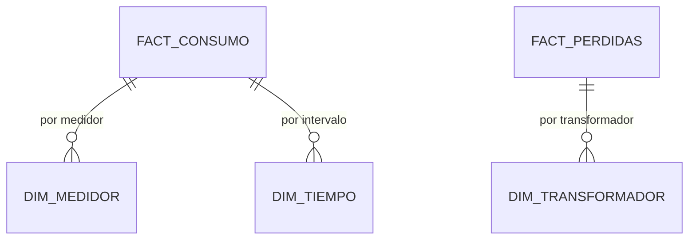

<h1 align="center">VoltaGrid Analytics</h1>

<p align="center">
  <a href="README.es.md">🇪🇸 Español</a> | <a href="README.md">🇺🇸 English</a>
</p>

<p align="center">
  <a href="https://powerbi.microsoft.com/"></a>
</p>

---

<p align="center">
  Modelo dimensional + tablero Power BI para VoltaGrid: hechos de consumo, pérdidas y eventos que responden las 6 preguntas de negocio con conciliación por consulta de control.
</p>

## Tabla de Contenido

- [Qué es / qué no es](#qué-es--qué-no-es)
- [Modelo](#modelo)
- [Estructura](#estructura)
- [Inicio Rápido](#inicio-rápido)
- [Preguntas de negocio](#preguntas-de-negocio)
- [Equipo](#equipo)
- [Documentación](#documentación)
- [Contribuir](#contribuir)

## Qué es / qué no es

<!-- TODO (P4): 5 líneas máx. Hechos (consumo, pérdidas, eventos) + dims (cliente, medidor, transformador, tiempo, franja, clima). Qué NO vive aquí (jobs→data, API→api). -->

## Modelo

<!-- TODO: diagrama estrella + grano por hecho. -->



## Estructura

```
voltiagrid-analytics/
├── model/          # TODO: ddl, definición hechos/dims
├── powerbi/        # TODO: .pbix + capturas
├── control-queries/# TODO: SQL de conciliación (números deben cuadrar con tablero)
├── docs/
│   ├── CONTRIBUTING.md
│   └── CONTRIBUTING.es.md
├── README.md
└── README.es.md
```

## Inicio Rápido

<!-- TODO: cómo abrir el .pbix + conexión a curated. -->

```bash
# TODO: dónde vive la muestra curated + cómo refrescar Power BI
```

## Preguntas de negocio

<!-- TODO (P4): listar las 6 preguntas + qué visual responde cada una + archivo de control. -->

| # | Pregunta | Visual | Query control |
|---|---|---|---|
| 1 | <!-- TODO --> | <!-- TODO --> | <!-- TODO --> |

## Equipo

| Rol | GitHub |
|---|---|
| P4 — Arquitectura y analítica (owner) | <!-- TODO: nombre + @github --> |

## Documentación

Arquitectura completa, ADRs y costos: `voltiagrid-docs`.

## Contribuir

Ver [CONTRIBUTING.es.md](docs/CONTRIBUTING.es.md) (copiar desde `voltiagrid-api/docs/`).
