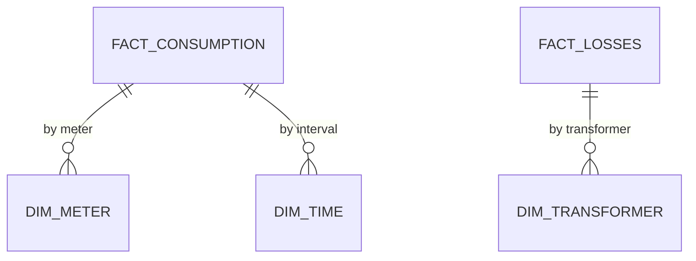

<h1 align="center">VoltaGrid Analytics</h1>

<p align="center">
  <a href="README.es.md">🇪🇸 Español</a> | <a href="README.md">🇺🇸 English</a>
</p>

<p align="center">
  <a href="https://powerbi.microsoft.com/"></a>
</p>

---

<p align="center">
  Dimensional model + Power BI dashboard for VoltaGrid: consumption, losses and demand-response facts answering the 6 business questions with control-query reconciliation.
</p>

## Table of Contents

- [What it is / is not](#what-it-is--is-not)
- [Model](#model)
- [Structure](#structure)
- [Quick Start](#quick-start)
- [Business questions](#business-questions)
- [Team](#team)
- [Documentation](#documentation)
- [Contributing](#contributing)

## What it is / is not

<!-- TODO (P4): 5 lines max. Facts (consumption, losses, events) + dims (customer, meter, transformer, time, band, weather). What does NOT live here (jobs→data, API→api). -->

## Model

<!-- TODO: star schema diagram + grain per fact. -->



## Structure

```
voltiagrid-analytics/
├── model/          # TODO: ddl, facts/dims definitions
├── powerbi/        # TODO: .pbix + screenshots
├── control-queries/# TODO: SQL reconciliation queries (numbers must match dashboard)
├── docs/
│   ├── CONTRIBUTING.md
│   └── CONTRIBUTING.es.md
├── README.md
└── README.es.md
```

## Quick Start

<!-- TODO: how to open the .pbix + connection to curated. -->

```bash
# TODO: where curated sample lives + how to refresh Power BI
```

## Business questions

<!-- TODO (P4): list the 6 questions + which visual answers each + control query file. -->

| # | Question | Visual | Control query |
|---|---|---|---|
| 1 | <!-- TODO --> | <!-- TODO --> | <!-- TODO --> |

## Team

| Role | GitHub |
|---|---|
| P4 — Architecture & analytics (owner) | <!-- TODO: name + @github --> |

## Documentation

Full architecture, ADRs and costs: `voltiagrid-docs`.

## Contributing

See [CONTRIBUTING.md](docs/CONTRIBUTING.md) (copy from `voltiagrid-api/docs/CONTRIBUTING.md`).
